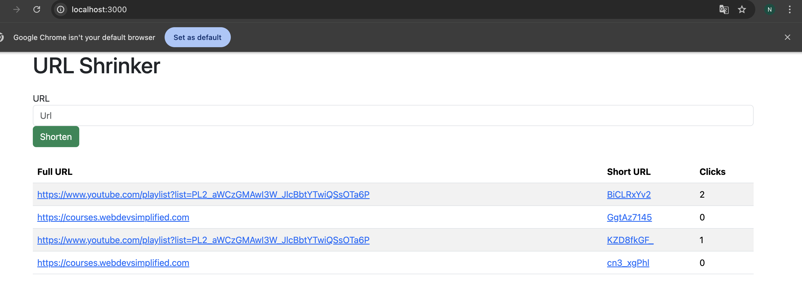

# URL-Shortener

A simple URL shortening service built using **Node.js**, **Express**, **MongoDB**, and **EJS**. It allows users to shorten long URLs, track how many times each short link has been visited, and redirect users to the original URL.



## 🚀 Demo

Try it locally by running the app and visiting: `http://localhost:3000`

---

## 🛠 Tech Stack

| Technology | Purpose |
|------------|---------|
| Node.js    | Backend runtime |
| Express.js| Web framework |
| MongoDB   | Database to store URLs |
| Mongoose  | ODM to interact with MongoDB |
| EJS       | Template engine for rendering frontend |
| Bootstrap | Styling and responsiveness |
| shortid   | To generate unique short links |
| dotenv    | To manage environment variables |

---

## 🧠 Features

- Create short versions of long URLs.
- Automatically generate unique short codes using `shortid`.
- Store URLs in a MongoDB database.
- Track number of clicks for each short URL.
- Redirect users to the original long URL.

---

## 🧰 Project Structure

├── models/ │ └── shortUrl.js # Mongoose schema for URL model 
├── views/ │ └── index.ejs # Frontend template 
├── .env # Contains MONGO_URI and optional PORT 
├── server.js # Main server file 
├── package.json 
└── README.md


---

## ⚙️ Installation & Setup

1. **Clone the repository**
```bash
git clone https://github.com/yourusername/url-shortener.git
cd url-shortener

2. Install dependencies
npm install

3. Set up environment variables Create a .env file at the root with the following:
MONGO_URI=your_mongodb_connection_string
PORT=3000

4. Run the server
node server.js

5. Open your browser and visit: http://localhost:3000

---

## Workflow

Homepage (GET /)
Shows a form to input a long URL. Displays a table of all previously shortened URLs with their click counts.

Shorten URL (POST /shortUrls)
Takes the full URL input. Generates a short code using shortid. Saves to MongoDB.

Redirect (GET /:shortUrl)
When a short link is visited, it: Finds the corresponding full URL. Increments the click count. Redirects to the full URL.

📸 Example Output

Full URL	         Short URL	Clicks
https://google.com	  /abc123	   5
https://openai.com	  /xyz789	   2


✨ Future Enhancements (Ideas)

- Add QR code generation for short links.
- User authentication and dashboard.
- Custom short URLs.
- Expiry dates for short links.
- Analytics dashboard.


